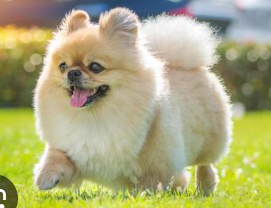
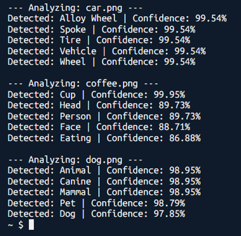
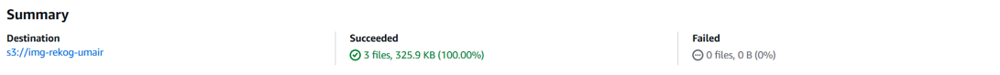
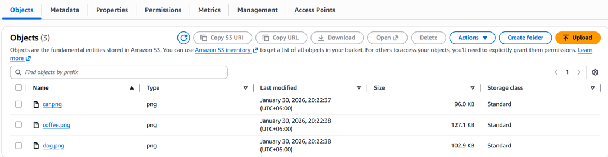

# 🚀 AWS Image Rekognition — Serverless Label Detection

This repository demonstrates a serverless image analysis workflow using **Amazon Rekognition** and **Amazon S3**. The project uses the AWS SDK for Python (`boto3`) to automatically identify objects and scenes within images.

## 🛠 Project Workflow

1. **Storage:** Images are uploaded to an Amazon S3 bucket.
2. **Analysis:** A Python script (run from AWS CloudShell or locally) sends the images to the Rekognition API.
3. **Extraction:** The script prints top-level labels (e.g., "Car", "Coffee", "Dog") with confidence scores.

---

## 📂 Project Structure

- `image-rekog.py`: Main Python script utilizing `boto3`.
- `requirements.txt`: Project dependencies.
- `s3-bucket/`: Local directory containing the sample dataset:
  - `car.png`
  - `coffee.png`
  - `dog.png`

## 🚀 Running the Script

### Installation

```powershell
python -m pip install -r requirements.txt
```

### Execution

```powershell
python image-rekog.py
```

## 📊 Sample Images

The images used in the CloudShell demo are included




## Rekog Results



## S3 Bucket


## Contents of S3 Bucket
