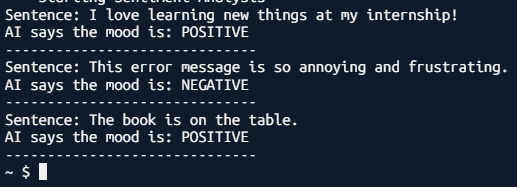

# Sentiment Analysis using Amazon Comprehend 🔍

**Project:** Sentiment analysis demo using AWS Comprehend via boto3.

## Overview ✨
This repository contains a simple script `Comprehend.py` that demonstrates how to use Amazon Comprehend to detect the sentiment of short text samples (Positive, Negative, Neutral, or Mixed).

## Files
- `Comprehend.py` — Sample Python script that calls `detect_sentiment` on a list of sentences.

## Prerequisites ✅
- Python 3.7+
- AWS account with Comprehend access and valid credentials configured (via `~/.aws/credentials` or environment variables).
- `boto3` installed. Install with:

```bash
pip install boto3
```

## Usage 🔧
1. Ensure AWS credentials are set and the IAM user/role has `comprehend:DetectSentiment` permission.
2. Run the script:

```bash
python Comprehend.py
```


## Results Screenshot 📸





